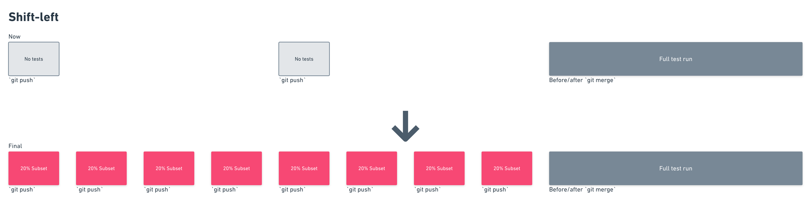

# About Launchable

## What is Launchable?


Before getting started, sign your team up for Launchable: [Sign up →](https://www.launchableinc.com/signup)

\(Launchable is free for small teams and open source projects. Otherwise, we offer a free 60-day trial\)


**Launchable** is a test recommendation engine that uses machine learning to speed up CI pipelines by selecting the right tests to run at the right stage of your development workflow. Launchable is a cloud-based software-as-a-service \(SaaS\) product.

Our team's mission is to make it possible for all development teams to apply state of the art testing techniques within their environment, reducing the risk of changes, and delivering greater value to their customers. We help teams dramatically reduce their testing cycle times to produce higher quality software, faster.

## How Launchable fits into your testing lifecycle

Depending on your situation, you can add Launchable to your CI pipeline in a few ways:

### Shift left

"Shift left" is an approach where you run a dynamic subset of a long running test suite earlier in the development lifecycle.

You might already run some suites less frequently, such as end-to-end UI tests, system tests, or nightly regression tests. These suites take too long to run on every `git push` or after every pull request is merged.

Launchable lets you "shift left" these tests by selecting a dynamic subset of the full test suite to run earlier in the lifecycle. Since each subset of tests is specifically selected for the changes being tested, you could refer to this approach as 'intelligent smoke testing.' For example, if a test suite that runs after every merge takes 5 hours to run, a 30 minute version of the same suite could be run on every `git push` while a pull request is still open. See the diagram below for a visual explanation.

### Shift right

"Shift right" is an approach to optimize CI tests that already run on every `git push`. They are already "shifted left" as far as possible, so now the task is to shift the less important tests to the _right_ \(i.e. run them less often\).

For example, you might already run unit tests, integration tests, and some end-to-end tests every time a developer pushes their branch. Over time, these test suites may grow to run in 30 or 45 minutes. You can use Launchable to "shift right" the _unimportant_ tests and run them less frequently.

Shifting right does introduce some risk of regression slippage. If you would like to mitigate this risk, you can start by just splitting your existing suite into an intelligence subset and then the remainder. After you've dialed in the right subset target, you can then remove the remainder and run the full suite less frequently. See the diagram below for a visual explanation.

