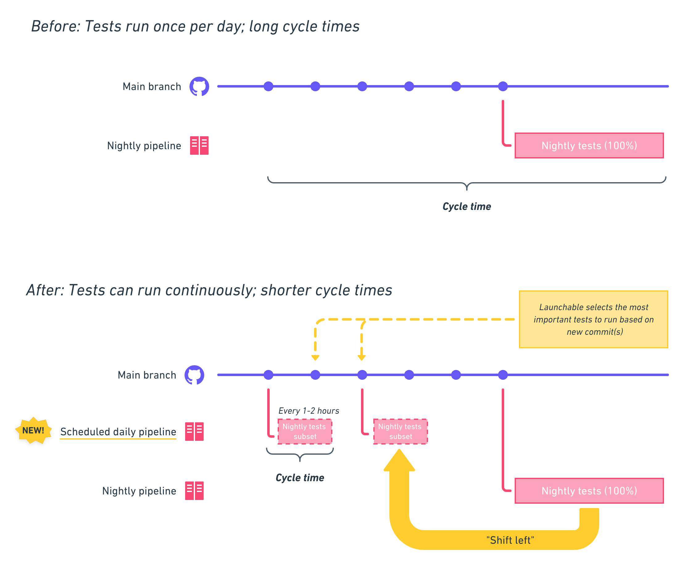
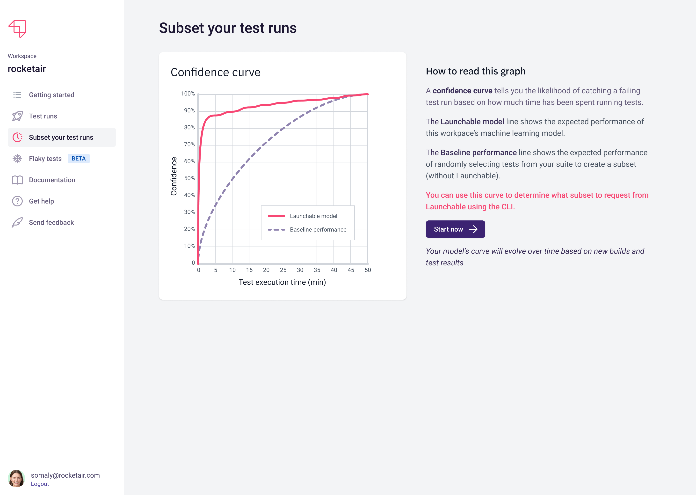

# Subsetting your test runs

## Overview

Soon after you've started sending data, you can start using Launchable to subset your test runs and save time.

The high level flow for subsetting is:

1. Get the full list of tests \(or test files, targets, etc.\) and pass that to `launchable subset` along with:
   1. an optimization target for the subset
   2. a build name, so Launchable can choose the best tests for the changes in the build being tested
2. `launchable subset` will get a subset from the Launchable platform and output that list to a text file
3. Pass the text file into your test runner to run only those tests

The diagram below illustrates the interactions between your tools, the Launchable CLI, and the Launchable platform:



The diagram above uses the generic term test _files_, but the real object type may be different depending on your stack \(e.g. test _classes_, test _targets_, etc.\).


## Preparing your pipeline for subsetting

Depending on your goal, you might need to make a few changes to your pipeline to adopt subsetting.

### Goal: Run a subset of tests at the same stage of your software delivery lifecycle

After subsetting your tests, you should make sure to run the full suite of tests at _some point_ later in your pipeline.

For example, once you start running a subset of an integration test suite that runs on pull requests, you should make sure to run the **full** integration test suite after a PR is merged \(and record the outcome of those runs with `launchable record tests`\).


### Goal: Run a subset of tests earlier in your software delivery lifecycle \("shift left"\)

If your goal is to run a short subset of a long test suite earlier in the development process, then you may need to set up a new pipeline to run tests in that development phase. For example, if you currently run a long nightly test suite, and you want to run a subset of that suite every hour, you may need to create a pipeline to build, deploy, and run the subset if one doesn't exist already.

You'll also want to continue running the full test suite every night \(and recording the outcome of those runs with `launchable record tests`\).



## Choosing an optimization target

The optimization target you choose determines how Launchable populates a subset with tests. You can use the **Confidence curve** shown at app.launchableinc.com to choose an optimization target. "Confidence" is defined as the likelihood an entire test run will pass or fail.




Launchable can also generate a **comprehensiveness curve**, which shows the percentage of individual test failures vs. duration. This graph is not available at app.launchableinc.com yet, so contact [support@launchableinc.com](mailto:support@launchableinc.com) to get yours.


### Confidence target \(`--confidence`\)

**Confidence** is shown on the y-axis of a confidence curve. When you request a subset using `--confidence 90%`, Launchable will populate the subset with relevant tests up to the corresponding expected duration value on the x-axis. For example, if the corresponding duration value for 90% confidence is 3 minutes, Launchable will populate the subset with up to 3 minutes of the most relevant tests for the changes in that build. This is useful to start with because the duration should decrease over time as Launchable learns more about your changes and tests.

### Fixed time target \(`--time`\)

**Time** is shown on the x-axis of a confidence curve. When you request a subset using `--time 10m`, Launchable will populate the subset with up to 10 minutes of the most relevant tests for the changes in that build. This is useful if you have a maximum test runtime in mind.

### Percentage time target \(`--target`\)

**Percentage time** is not yet shown in any charts at app.launchableinc.com. When you request a subset using `--target 20%`, Launchable will populate the subset with 20% of the expected duration of the most relevant tests. For example, if the expected duration of the full list of tests passed to `launchable subset` is 100 minutes, Launchable will return up to 20 minutes of the most relevant tests for the changes in that build. This is useful if your test runs vary in duration.

## Requesting and running a subset

To retrieve a subset of tests, first list all the tests you would normally run and pass that to `launchable subset`. Here's an example using Ruby/Minitest and `--confidence`:

```bash
launchable subset \
  --build <BUILD NAME> \
  --confidence 90% \
  minitest test/**/*.rb > launchable-subset.txt
```

The `--build` option should use the same `<BUILD NAME>` value that you used in `launchable record build`.

This creates a file called `launchable-subset.txt` that you can pass into your command to run tests:

```bash
bundle exec rails test $(cat launchable-subset.txt)
```

Subsetting instructions depend on the test runner or build tool you use to run tests. Click the appropriate link below to get started:

* [Android Debug Bridge \(adb\)](../resources/integrations/adb.md#subsetting-your-test-runs)
* [Ant](../resources/integrations/ant.md#subsetting-your-test-runs)
* [Bazel](../resources/integrations/bazel.md#subsetting-your-test-runs)
* [Behave](../resources/integrations/behave.md#subsetting-your-test-runs)
* [CTest](../resources/integrations/ctest.md#subsetting-your-test-runs)
* [Cypress](../resources/integrations/cypress.md#subsetting-your-test-runs)
* [GoogleTest](../resources/integrations/googletest.md#subsetting-your-test-runs)
* [Go Test](../resources/integrations/go-test.md#subsetting-your-test-runs)
* [Gradle](../resources/integrations/gradle.md#subsetting-your-test-runs)
* [Maven](../resources/integrations/maven.md#subsetting-your-test-runs)
* [Minitest](../resources/integrations/minitest.md#subsetting-your-test-runs)
* [Nose](../resources/integrations/nose.md#subsetting-your-test-runs)
* [Pytest](../resources/integrations/pytest.md#subset-your-test-runs)
* [Robot](../resources/integrations/robot.md#subsetting-your-test-runs)
* [RSpec](../resources/integrations/rspec.md#subsetting-your-test-runs)

## Other tips

### "Training wheels" mode with the --rest option

You can start subsetting by just splitting your existing suite into an intelligent subset and then the rest of the tests. After you've dialed in the right subset target, you can then remove the remainder and run the full suite less frequently. See the diagram below for a visual explanation.


The middle row of the diagram shows how you can start by splitting your existing test run into two parts:

1. A subset of dynamically selected tests, and
2. The rest of the tests

The example below shows how you can generate a subset \(`launchable-subset.txt`\) and the remainder \(`launchable-remainder.txt`\) using the `--rest` option. Here we're using Ruby and Minitest:

```bash
launchable subset \
  --build <BUILD NAME> \
  --confidence 90% \
  --rest launchable-remainder.txt \
  minitest test/**/*.rb > launchable-subset.txt
```

This creates two files called `launchable-subset.txt` and `launchable-remainder.txt` that you can pass into your command to run tests in two stages. Again, using Ruby as an example:

```bash
bundle exec rails test $(cat launchable-subset.txt)

bundle exec rails test $(cat launchable-remainder.txt)
```

You can remove the second part after you're happy with the subset's performance. Once you do this, make sure to continue running the full test suite at some stage as described in [Preparing your pipeline](subsetting-your-test-runs.md#preparing-your-pipeline).

### Replacing static parallel suites with a dynamic parallel subset

Some teams manually split their test suites into several "bins" to run them in parallel. This presents a challenge adopting Launchable, because you don't want to lose the benefit of parallelization.

Luckily, with **split subsets** you can replace your manually selected bins with automatically populated bins from a Launchable subset.

For example, let's say you currently run ~80 minutes of tests split coarsely into four bins and run in parallel across four workers:

* Worker 1: ~20 minutes of tests
* Worker 2: ~15 minutes of tests
* Worker 3: ~20 minutes of tests
* Worker 4: ~25 minutes of tests

With a split subset, you can generate a subset of the full 80 minutes of tests and then call Launchable once in each worker to get the bin of tests for that runner.

The high level flow is:

1. Request a subset of tests to run from Launchable by running `launchable subset` with the `--split` option. Instead of outputting a list of tests, the command will output a subset ID that you should save and pass into each runner.
2. Start up your parallel test worker, e.g. four runners from the example above
3. In each worker, request the bin of tests that worker should run. To do this, run `launchable split-subset` with:
   1. the `--subset-id` option set to the ID you saved earlier, and
   2. the `--bin` value set to `bin-number/bin-count`.
4. Run the tests in each worker.
5. After each run finishes in each worker, record test results using `launchable record tests` with the `--subset-id` option set to the ID you saved earlier.

In pseudocode:

```text
# main
$ launchable record build --name $BUILD_ID --source src=.
$ launchable subset --split --confidence 90% --build $BUILD_ID bazel .
subset/12345

...

# worker 1
$ launchable split-subset --subset-id subset/12345 --bin 1/3 --rest rest.txt bazel > subset.txt
$ bazel test $(cat subset.txt)
$ launchable record tests --subset-id subset/12345 bazel .


# worker 2
$ launchable split-subset --subset-id subset/12345 --bin 2/3 --rest rest.txt bazel > subset.txt
$ bazel test $(cat subset.txt)
$ launchable record tests --subset-id subset/12345 bazel .

# worker 3
$ launchable split-subset --subset-id subset/12345 --bin 3/3 --rest rest.txt bazel > subset.txt
$ bazel test $(cat subset.txt)
$ launchable record tests --subset-id subset/12345 bazel .
```

