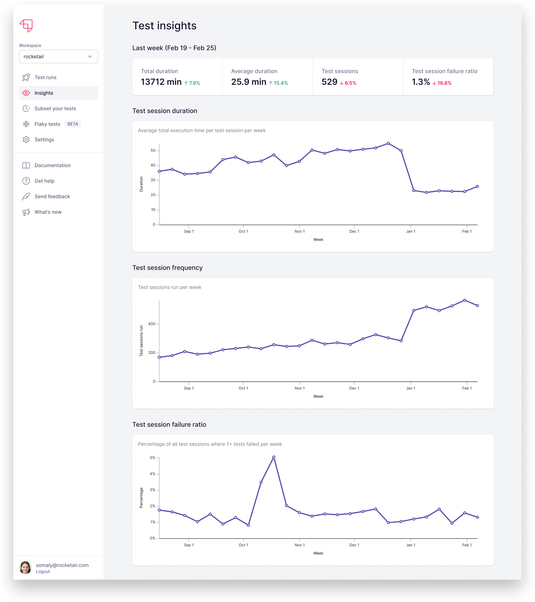

# Test Insights

## Test Insights

Launchable also analyzes your test data in aggregate to surface insights and trends. You can use this information to improve the health of your test suite and get maximum value out of your test runs.

### Trends

The Insights page shows [trends.md](trends.md "mention") about your test sessions, including average test session duration, test session frequency, and how often sessions fail.

Seeing this data over time gives you a picture of how your test suite evolves; for example, perhaps your tests are taking twice as long as they did six months ago, and you need to cut it down! Similarly, perhaps your team's running tests a lot more often than expected, which is driving up resource costs. Or maybe you have some broken tests that are driving up the overall failure rate.

### Flaky tests

Launchable also surfaces [flaky-tests.md](flaky-tests.md "mention") in your test suite so you can fix them and run tests more reliably. Each test gets a score based on past results; a higher score means the test exhibits more flakiness and should be fixed ASAP!

##
