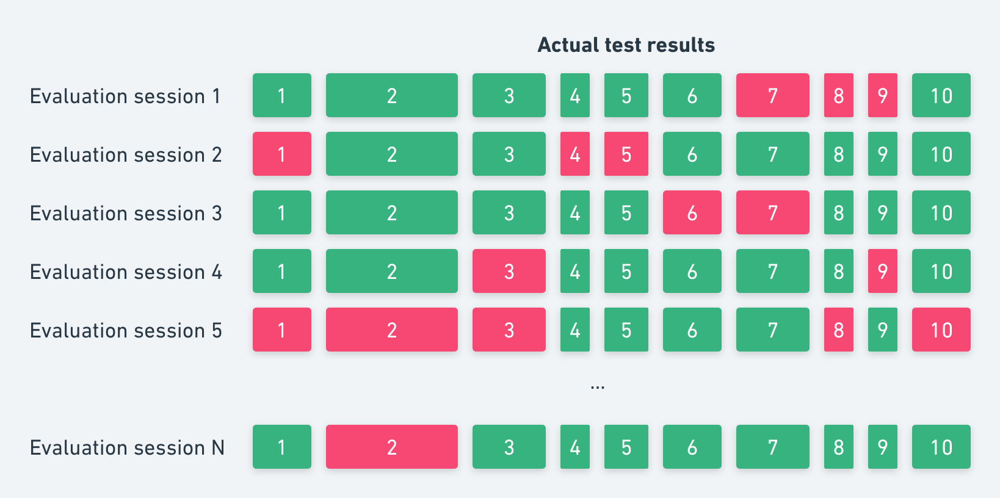
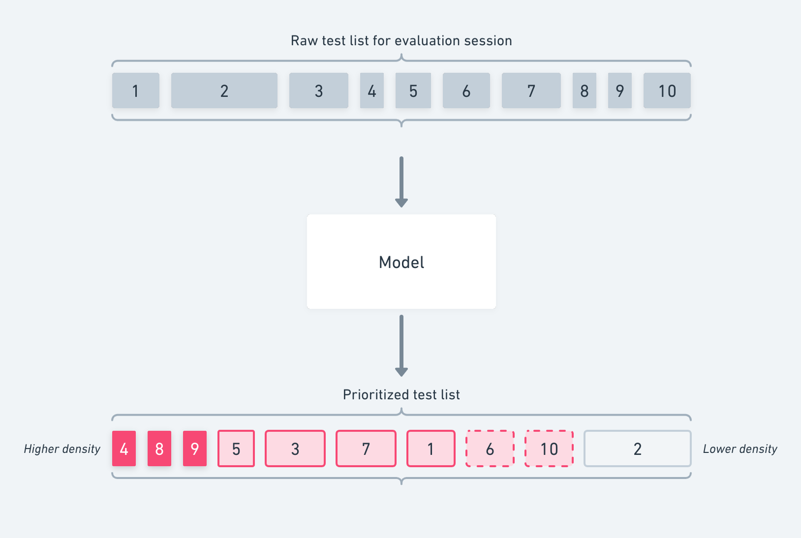
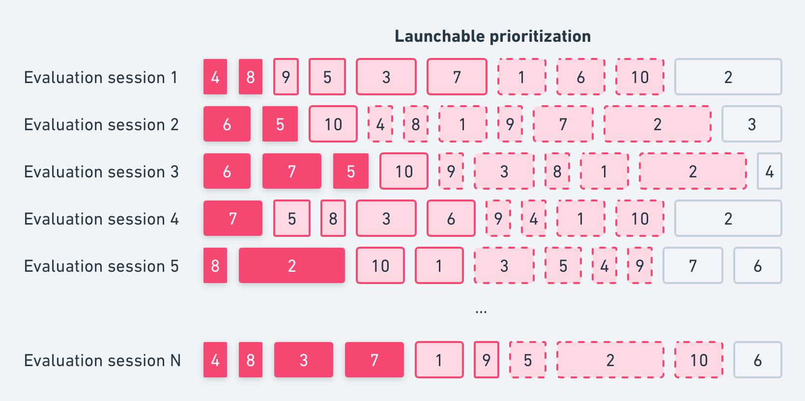
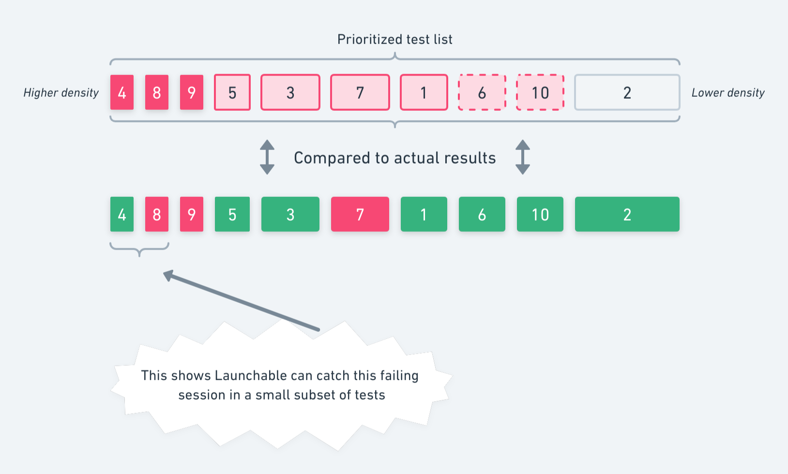
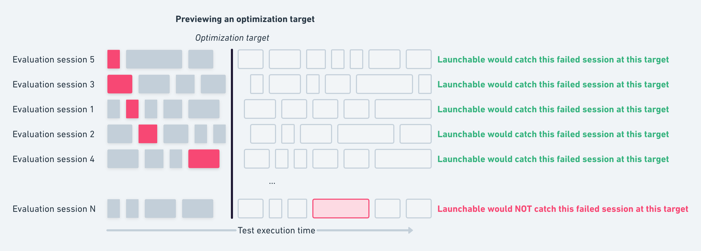

# How a Confidence curve is generated

Every time you [request a subset of tests](../subsetting-with-the-launchable-cli/) from Launchable, your workspace's predictive model is put to use. Launchable builds new predictive models from your test sessions on a regular basis.&#x20;

Building a model has two major steps: **training** and **evaluation**. Because of this, we first split your test sessions into a training dataset and an evaluation dataset. The majority of the test sessions are added to the training dataset, and the remaining test sessions are added to the evaluation dataset.

Then, we train a new model using the training dataset. The model learns from these builds+test sessions. Its goal is to learn which tests are most likely to fail first based on historic test results and the changes being tested.

Finally, after the model's trained, we want to know how effective this newly trained model is at reordering tests. This process is called model evaluation. A Confidence curve is a key artifact created by this process.

<figure><figcaption>
Example Confidence curve in the Launchable dashboard
</figcaption></figure>

### Model evaluation

First, we take all the test sessions in the evaluation dataset.

We can visualize the result of a single session like this. Each block represents a test. Green means the test passed when it originally ran, and red means it failed. Wider blocks took longer to run; narrower blocks too less time to run.

<figure><figcaption></figcaption></figure>

Of course, there are multiple sessions in the evaluation dataset, which we can visualize like this:

<figure><figcaption></figcaption></figure>

Then, for each session in the evaluation dataset, we ask the model to prioritize all the tests from that test session + build combination (see [how-launchable-selects-tests.md](../../how-launchable-selects-tests.md "mention")).

The model returns the list of test prioritized by failure density, i.e. how useful this test is at finding failures per second of test execution time.

Visualizing this process, again using a single session:

<figure><figcaption></figcaption></figure>

And again in aggregate across all our evaluation sessions:

<figure><figcaption></figcaption></figure>

The important thing to note is that **the model hasn't "seen" these test sessions before** - they were not used for training - but we know which tests passed and failed, because we have the full results! This lets us compare the actual test results for that session against the model's prediction of which tests had higher failure density. This tells us that -- for this session, at least -- Launchable can find a failing session by only running a small subset of tests:

<figure><figcaption></figcaption></figure>

If we're looking for test session failures _(i.e. will the tests pass or not?)_, one failure is enough. It only takes one failing test case for the whole session to fail. When choosing an optimization target, we need to run enough tests that we're not going to mark a session as passing when it really failed. That's the definition of **confidence**.

By stacking a bunch of evaluation sessions together and seeing how long it takes Launchable to find a single failure, we can see Launchable's performance in aggregate. Sometimes Launchable's prioritization of an evaluation session will find the first failure earlier, whereas other times it'll find it later. We can sort the evaluation sessions by how long this takes, like this:

<figure><figcaption></figcaption></figure>

Then we can imagine an optimization target. How many failing sessions would we miss if we only ran a portion of the tests, like this:

<figure><figcaption></figcaption></figure>

At this stage, we've run all the evaluation sessions through the model, and we've compared the prioritization to the real results. Finally, we use this data to create your Confidence curve.

<figure><figcaption></figcaption></figure>

On the X-axis, we have test execution time. The upper bound of this axis is the maximum total execution time from all the evaluation sessions.

On the Y-axis, we have the Confidence percentage. This is the probability of correctly catching a failing session. When choosing an optimization target, we need to run enough tests that we're not going to mark a session as passing when it really failed. That's what this percentage represents.

The pink line represents the intersection of these two factors aggregated across all the evaluation test sessions. Logically, the line starts at (0,0%) and ends at (\[max],100%): if we run no tests, we'll miss every failing session, and if we run all the tests, we'll catch every failing session. However, Launchable's power is in the in-between. Notice how the pink line isn't straight: it's curved to the left. This means that Launchable can catch more failing sessions in less time!

For example, the above image tells us that if we set our optimization target to **90% confidence**, we should expect to only run 10 minutes of tests (X-axis), and we should expect to catch 90% of failing sessions (Y-axis). Similarly, if we set our optimization target to 25 minutes (X-axis), we should expect to catch 95% of failing sessions (Y-axis). Both of these are great improvements over running all the tests.
