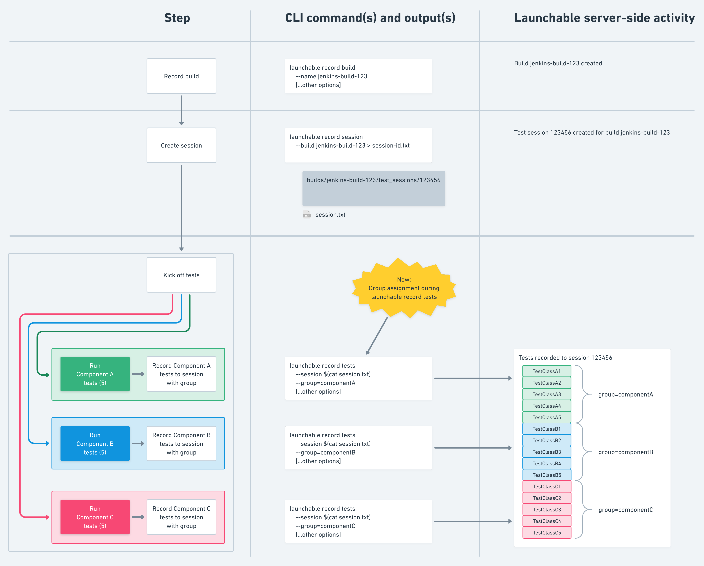

# Using groups to split subsets

It's common for teams to split up a large test suite into many smaller groups, often executed in parallel.

Perhaps your pipeline tests multiple components __ or plugins, or maybe your framework forces this kind of organization (e.g. [nunit.md](../../../../../resources/integrations/nunit.md "mention") organizes tests by `.dll`). In any case, all the groups are tested together (comprising a single [test-session.md](../../../../../concepts/test-session.md "mention")), but each group has its own small test suite.

To better support this scenario, [.](./ "mention") makes it possible to request a single "high level" subset across all components.

Now, a new concept called **groups** intends to improve the usability of this approach:

* First, you can now use `--split-by-group` to split the "high level" subset file into one file for each group, simplifying test distribution across groups
* Second, when you use `--split-by-group`, the CLI writes a special file informing you which groups you can skip entirely, saving setup time


Currently, only the **Maven** profile supports test groups, so this document uses instructions for Maven.


## Assigning tests to groups

Before you can use `--split-by-group`, you need to assign your tests to their respective groups. Each test can belong to one test group at a time. A group aligns with component/plugin/DLL -- whatever your organizational container is.

You can assign a set of tests to a group by running `launchable record tests` with the `--group=[groupName]` option.

This means that if you have 10 groups, you'll run `launchable record tests` 10 times.

### Example: Group assignment using the CLI

For example, let's say we have 3 components: A, B, and C. Each group has 5 test items. We'll assign each to groups. (Note the use of `--group` on each `launchable record tests`)

<figure><figcaption><p>Assigning tests to 3 groups</p></figcaption></figure>

For clarity, here are the commands:

```
# before building software
launchable record build \
    --name jenkins-build-123\
    [...other options]

...[build steps]...

# before running tests create a test session so we can collect all the results together
launchable record session \
    --build jenkins-build-123 > session-id.txt

    # componentA tests
    ...[run componentA tests]...
    launchable record tests \
        --session $(cat session-id.txt) \
        --group=componentA \
        [...other options] \
        /path/to/componentA/results

    # componentB tests
    ...[run componentB tests]...
    launchable record tests \
        --session $(cat session-id.txt) \
        --group=componentB \
        [...other options] \
        /path/to/componentB/results
    
    # componentB tests
    ...[run componentC tests]...
    launchable record tests \
        --session $(cat session-id.txt) \
        --group=componentC \
        [...other options] \
        /path/to/componentC/results
```


The examples on this page describe a scenario with only 3 groups. This is just for illustrative purposes. In reality, this approach is for teams with lots of groups (e.g. 10+).


## Splitting subsets by group

Once you've assigned your tests to groups, you can create a high level subset and then split it by group. This involves two commands run one after another in your main CI pipeline, before you run any component pipelines:

1. `launchable subset` with the `--split` option added. This option modifies the command's output to return a subset ID string instead of the subset contents. You'll use this ID in the next command.
   * The `--get-tests-from-previous-sessions` and `--output-exclusion-rules` options should also be included, per [.](./ "mention")
   * In this step, Launchable creates a "high level" exclusion list and stores it for retrieval in the next step.
2. `launchable split-subset` with the `--split-by-group` option. This command outputs several files for use in your pipeline (see below).
   * The `--subset-id` option is also required. This uses the value from the previous command.
   * In this step, Launchable splits the just-created exclusion list by group. It also creates a list of which groups you need to set up in order to run these tests.

#### Special output files

When you run `launchable split-subset` with the `--split-by-group` and the `--output-exclusion-rules` option, the CLI creates several files:

* `subset-groups.txt`
  * Since `--output-exclusion-rules` was used with `launchable subset`, this file contains a list of the groups that you can skip entirely.
* `subset-[groupname].txt` (one file for each group)
  * Each file contains the normal subset output, but only for that group's tests. You can pass these files into the test process for each group.
  * Since `--output-exclusion-rules` was used, these files will contain exclusion rules. You're supposed to **exclude** these tests.
* `subset-nogroup.txt`
  * This file contains tests that had no group assignment, if there are any.

See the [cli-reference.md](../../../../../resources/cli-reference.md "mention") for additional options.

### Example: Split output by group using the CLI

In this example we'll continue the scenario from above. We have 3 groups, each with 5 tests. We've already assigned each test to its respective group. Now we want to use that.

This diagram shows the flow. First we create a subset from all the tests across all groups. Then we split those into groups. Note the special file `subset-groups.txt` which shows us we can skip component B entirely.

<figure><figcaption><p>Entire Zero Input Subsetting flow with --split-by-groups added in</p></figcaption></figure>


Note that the diagram shows the contents of `subset-component*.txt` as a list of classes. This is the output format for Maven.

If you use a different test runner, your output might be different. Every test runner has its own exclusion syntax.


```
# before building software
launchable record build \
    --name jenkins-build-123\
    [...other options]

...[build steps]...

# before running tests create a test session so we can collect all the results together
launchable record session \
    --build jenkins-build-123 > session-id.txt

# create the server side subset
launchable subset \
    --session $(cat session-id.txt) \
    --split \
    --get-tests-from-previous-sessions \
    --output-exclusion-rules > subset-id.txt

# split that for use locally
launchable split-subset \
    --subset-id $(cat subset-id.txt) \
    --split-by-groups \
    --output-exclusion-rules \
    maven
```

At this stage we have several files:

* `subset-groups.txt`
  * `componentB`
* `subset-componentA.txt`
  * Exclusion rules for component A
* `subset-componentB.txt`
  * Exclusion rules for component B
* `subset-componentC.txt`
  * Exclusion rules for component C

Because `subset-groups.txt` contains `componentB`, we can write a script to skip that group's test setup entirely. (How you do this depends on your setup. Need help? Let us know.)

Finally, we pass each component's exclusion file into the remaining test processes for each group:

* `subset-componentA.txt` gets passed into the test process for component A
* `subset-componentC.txt` gets passed into the test process for component C

We follow the normal instructions for using an exclusion rule (see the documentation for your test runner) so that only those tests run.

For example, here's a basic invocation of [maven.md](../../../../../resources/integrations/maven.md "mention") for component A, complete with test recording at the end:

```
# component A
# run component A tests with Launchable exclusions
mvn test -Dsurefire.excludesFile=$PWD/subset-componentA.txt

# record tests
launchable record tests \
        --session $(cat session.txt) \
        --group=componentA \
        [...other options] \
        /path/to/componentA/results
```

As a result we were able to entirely eliminate component B (in this example) from the test process, saving time!

#### A note about new tests

Because component B was entirely skipped, if there are any **new** group B tests, they didn't get run. This is the tradeoff of saving the setup time. To mitigate this, you should have a full run scheduled at a later stage in your pipeline, so they'll run then.
