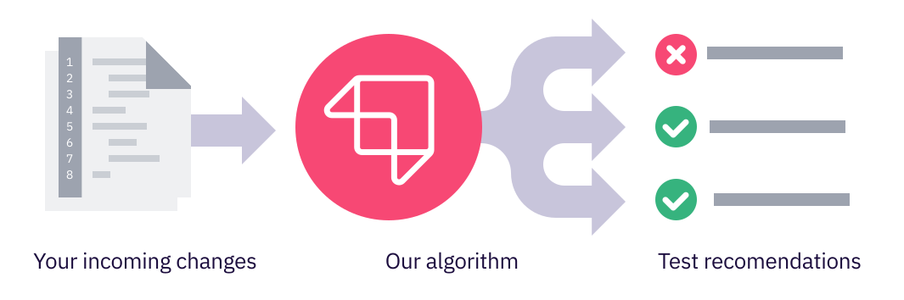

# How it works

## The basics

The core of the Launchable platform is a machine learning algorithm that reorders tests based on incoming changes so that tests that are likely to fail are run first.

The algorithm analyzes incoming changes and assigns a probability of failure to each test in a suite based on past runs. It then determines the best order in which your test runner should run those tests. Tests are ordered based on probability of failure and test run time \(more on this later\).

## How the model is trained

Every time tests run, the results are passed to Launchable to continuously train the model.

Model training looks at the changes associated with each build and which tests failed when tests ran. It builds associations between line changes in files and which tests tend to fail. It can be thought of as an advanced frequency counting algorithm that tracks associations between test failures and source code changes.

Model training generally takes **between 3 and 10 weeks,** depending on how often tests run and how many tests fail in a typical run. More data improves the quality of the model, but reasonable accuracy is generally obtained within a few weeks.

## Calculating test order

One way to think about how Launchable reorders your tests is that with each successful test, Launchable's confidence that the entire run will be successful grows. The ideal algorithm optimizes for the **highest confidence as early as possible.**

So _confidence gain_ and _individual test run time_ are the two primary determining factors for test reordering.

Confidence is a function of the probability of failure for each individual test as tests run. Tests with a high probability of failure yield a higher confidence gain when successful. When tests with a low probability of failure pass, they yield smaller confidence gains.

Since our goal is to deliver as much confidence as quickly as possible, it makes sense for Launchable to _deprioritize_ a long running test if the confidence gain from that single test is not high enough to offset the gain of running shorter tests during the same period of time. This is exactly what the Launchable algorithm does.

For example, if test T8 has a high probability of failure and takes 3 minutes to run, and test T4 has a slightly lower probability of failure but only takes 300 milliseconds, Launchable will prioritize the shorter test \(T4\) before the longer test \(T8\) because it yields a higher confidence gain in a shorter period of time.


We are currently exploring other factors that may influence test order such as cases where tests have order dependency on other tests. [Contact us](https://launchableinc.com/contact) if you're interested in learning more.


## Subsetting tests

If your tests take a long time to run, you should consider running a subset of your tests earlier in your development cycle. We call this use case "shift-left."

For example, if a test suite that runs after every merge takes 5 hours to run, a 30 minute version of the same suite could be run on every `git push` while a pull request is still open.

While you could accomplish this by manually selecting which tests to run, this has the disadvantage that the tests _most relevant to the changes present in a build_ may not be run until much later in the development cycle. Launchable provides the ability to create a subset based on the changes present in the build every time you run tests. We call this a _dynamic subset_ because the subset adapts to your changes.

A **dynamic subset** leverages the same test sequence generated for reordering tests but only returns the first part of the total sequence to your test runner. The cutoff point can be based on either the maximum length of time you specify \(30 minutes in the above example\) or the minimum confidence level you wish to achieve.

## How it integrates with your CI tool

Launchable integrates with your CI tool via the **Launchable CLI**.

When a build is ready for testing:

1. Your CI tool sends the changes in the build, the full list of tests to run, and a target for the test run \(e.g. 20 minutes\) to Launchable.
2. Launchable responds with which tests to run based on the changes in the build and the target.
3. Your CI tool runs the subset of tests using your build tool or test runner \(e.g. maven, gradle\).
4. When the run ends, your CI tool sends the tests results to Launchable to continuously train the machine learning model.

## What data is sent to our servers?

Launchable’s machine-learning algorithm learns about the relationship between code changes and the tests impacted by those changes via metadata that you send to us via the CLI.

We do not currently employ static code analysis, so the full contents of your source code are not sent to our servers. The data that is sent currently includes...

Metadata about the **code changes being tested**:

* the names and paths of files added/removed/modified in the change
* number of modified lines in files in the change
* the location of modified lines in the files in the change
* Git commit hashes associated with the change
* Git author details associated with those commits

Metadata about the **test cases that were run**:

* the names and paths of test cases and test files
* pass/fail/skipped status of each test case
* the duration \(run time\) of each test case
* test case associations to test suites \(e.g. ‘unit tests,' ‘integration tests,’ etc.\)
