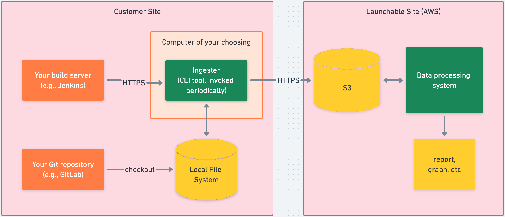

# Security policies

Launchable is a multi-tenant SaaS where data is sent from a customer site to Launchable.

This document covers frequently asked questions related to information security \(infosec\).

## Security

### Does Launchable maintain a written security plan or other security governance?

Yes, we do. We can furnish details upon request.

### Does Launchable hold any security certifications?

We inherit the certifications that our cloud provider \(AWS\) maintains. These are SOC2 Type 2, ISO27001, and ISO27017.

### Is access to personal information limited only to those individuals that need access to the information to perform the services?

Yes. Access controls are specifically granted only to individuals whose job function requires it.

