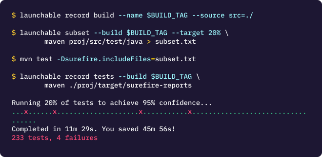

# FAQ

## Problems that Launchable can solve

### Key value proposition: Ship code faster by testing faster

Software development teams are under pressure to deliver code faster while still maintaining high quality.

There are numerous approaches to help teams deliver code faster: building a CI pipeline, automating tests, continuously delivering code to production. However, none of these help address the problem that running tests \(long or short\) is the bottleneck in delivering software.

Launchable's solution is to intelligently prioritize tests to cut down testing times without sacrificing quality. Developers get feedback much earlier in the development cycle. Launchable helps teams ship code faster by testing faster.

### Where does Launchable fit into my development pipeline?

Launchable is test agnostic - point us to the test suites that cause the most pain in your delivery, and Launchable can help reduce the time it takes to run them - delivering feedback earlier.

#### How do I use Launchable to change my testing lifecycle?

You can add Launchable in two ways - either **Shift left** or **Shift right**.

Think of **Shift left** as an approach to test for risks earlier by testing earlier \(typically by moving some nightly tests earlier\).

Think of **Shift right** as an approach to provide fast feedback by shifting less important tests later \(typically tests run on each `git push`\). See [About Launchable](../#how-launchable-fits-into-your-testing-lifecycle) for detailed writeup.

#### Does Launchable only work for "greenfield" or "brownfield" applications?

Launchable helps in both use cases. Launchable requires that the test suite under consideration is running at a reasonable frequency \(multiple times per week versus once a month\).

The key question to ask is "where are developers seeing pain from long testing times?" The answer tends to be different for different teams. Some teams want to cut down long integration test cycle times \(from hours to minutes\); this typically is the case in brownfield applications. Others want to cut down unit test cycles for faster feedback to developers \(from 30 minutes to less than 5 minutes\); this typically is the case in greenfield applications.


The key is to bring Launchable in as early as you can so that you can get the benefit of shipping code faster earlier.


#### Does Launchable work for microservices? Monoliths?

A question with a similar flavor to "greenfield or brownfield applications" with a similar answer. Launchable works equally well in both cases and solves similar challenges in both cases.

**Monoliths**: Teams with monoliths typically bring us in for the "nightly" test scenario. The team has accumulated a lot of tests over a period of time that cannot be run on every push. These teams look to shift left these nightly tests to provide feedback to developers as early as possible. Some teams use Launchable to help speed up unit or acceptance tests as the amount of tests have increased.

**Microservices**: Unit tests for individual microservices tend to run quickly for most organizations. However, the integration testing scenario remains a challenge \(just as with monoliths\). Thus, teams typically use Launchable to help with integration testing scenario. Teams that really care about having a fast dev loop on every `git push` use Launchable to optimize their unit tests.

### Where does Launchable _not_ help?

Manual tests: tests where developers are testing the application by hand.

Tests that run very infrequently: tests need to run _at least_ a few times a week to use Launchable.

#### What is the maturity in testing automation required? Or only _some_ of tests are automated, can Launchable help?

Yes. No team that ever has enough tests or enough testing automation. It is good to start by adding Launchable on top of what you already have; this helps improve feedback times early on, and you continue to reap benefits as your automation matures.

Launchable can help in scenarios where automated tests are triggered automatically or manually. Tests need to run on a reasonable frequency, though \(think multiple times per week versus once a month\).

## Launchable's Approach and Impact

### What makes Launchable unique?

Launchable is focused on finding the _**"needle in the haystack" for every change**_ to minimize test execution times. Launchable is based on an exciting Machine Learning based approach called [Predictive Test Selection](https://www.launchableinc.com/what-is-predictive-test-selection) being used by [Facebook](https://engineering.fb.com/2018/11/21/developer-tools/predictive-test-selection/) and Google. Predictive Test Selection is a branch of what is commonly known as [Test Impact Analysis](https://www.launchableinc.com/test-automation-glossary/test-impact-analysis).

Launchable is democratizing the Predictive Test Selection approach so that it is available to teams of all sizes at the push of a button. In the absence of this practice, teams have to manually create subsets "smoke tests" or parallelize their tests. \(Note: Launchable speeds up existing smoke tests or parallelized tests, too.\)

### What impact can Launchable make?

The key component that helps Launchable learn well is that the test suite should be run with reasonable **frequency** and should have **some failures**. Typically, teams see a reduction of 60-80% in test times without an impact on quality.

The primary reason that teams like Manba \([see case study](https://www.launchableinc.com/customers/manba-reducing-test-runtime-for-a-ruby-on-rails-application)\) use Launchable is that it has enabled the team to ship code faster and push more changes through.

> My test runtime went down 90 percent! Deployment to Heroku went from 30 to 10 minutes.
>
> It is great, just great!
>
> -- Masayuki Oguni, CEO and Lead Developer

Larger teams have focused on improving developer productivity times in addition to increasing software delivery velocity. See case studies of an [auto manufacturer](https://www.launchableinc.com/customers/reducing-slow-test-cycles-at-rocketcar-case-study) and a [Silicon Valley Unicorn](https://www.launchableinc.com/customers/a-silicon-valley-icon-reduces-slow-delivery-cycles-by-testing-faster-and-improves-developer-happiness-case-study) using Launchable.

## Trialing and using Launchable

### What is the effort required to add Launchable to my teams CI pipeline?

You instrument your build script with 4 commands.

1. Send information about the changes being tested
2. Request a subset of tests from Launchable
3. Run those tests using your existing tooling
4. Send information about test failures/successes to train the model

We have built integrations to various test runners to make the process of interacting with Launchable easy. Here is an example of how these commands look when using Maven.

The [Getting started](../getting-started/) guide will walk you through each step in detail.

### How long does it take to train a model?

Typically, it takes about 4 weeks to train the model for a test suite that is run with a reasonable frequency and has failures to learn from.

That said, you can start using Launchable from day 1 using the `--rest` option in the [CLI](cli-reference.md#subset). Here, you are using Launchable to return 1\) a subset and 2\) the rest of the tests. You can then run both these with your test runner. As the model learns, the subset will start capturing more issues and ultimately where you can confidently remove the rest of the tests.

### Can you help us add Launchable to our build scripts?

Most teams get going very quickly. However, if you would like us to talk to your team to help through with the instrumentation, reach out to our [sale team](https://www.launchableinc.com/contact-sales) to set up a call. You can also join our [Discord community channel](https://www.launchableinc.com/community).

### Can I try Launchable?

Yes. We offer free trials as well as a free tier for small teams \(and open source projects\). If you work at a large company, we can help you through a POC. See more on the [pricing](https://www.launchableinc.com/pricing) page.

## Responses to key questions from customers

Customer questions fall into three buckets: testing, machine learning, and security.

### Questions about testing

#### Do I end up testing less with Launchable?

**Key Idea: You are testing more frequently** In short, the answer is no: teams tend to test more frequently with Launchable. Because Launchable reduces testing times, you can execute more test runs as a result. The tests in each run are dynamically selected for every code change.

#### What happens to the tests that are not run? This will surely impact quality!

**Key idea: Defensive runs** We ask our customers to view Launchable as a way to speed up tests and ship code faster. The tests that are not run as part of the subset should be run as part of a **defensive** run. The defensive run captures any tests that escape through the subset. The defensive run is instrumented to send us the test rests and thus Launchable uses this run \(in addition to the subset\) to train the model.

### Questions about machine learning models

#### How often is my team's model trained?

Your model is trained nightly.

#### Is the model shared between customers?

No. Each model is specific to each customer.

#### How does the model learn about new code or new tests?

This question covers three scenarios \(outlined in the graphic below\).

**Scenario 1** : Existing code and existing tests

This is "business as usual" scenario i.e. either existing code or existing tests are modified. The model predicts which tests to run and uses the subset results and the defensive runs result to update itself to predict better the next time around.

**Scenario 2**: New code and new tests

This scenario is about when there is active new development happening and new tests are added at the same time. The model sees new tests and schedules them to be run because it doesn't know about them. The model then uses the data from this run and trains itself. From day 2, the model behaves as scenario 1 - initially, it may still get more wrongs than right because the codebase is new and thus the defensive runs become important to catch any issues that escape and train the model to perform better.

**Scenario 3**: New code and existing tests

This scenario is where new code is added but developers expect the existing tests to catch the issues. The model predicts the tests as in scenario 1. Note: if existing tests don't test for the new code, the model cannot do much about it - developers will need to first build the test cases to provide enough code coverage.

#### How do you evaluate the performance of a model?

We use a model performance curve. This curve is based on the actual data sent by the customer. We split the data into training and evaluation data to measure the performance of the model.

Here, the red line is the baseline \(without Launchable\) from an actual customer. The baseline shows that it takes about 75% tests to get to 90% confidence where confidence is the likelihood of a failing test run. Thus, this customer finds 90% of failing runs after running 75% of the tests. In their case, the test run was about 1 hour, so the test suite had to run about 45 minutes to get to 90% of issues.

The Launchable model \(blue line\) could get to the same 90% confidence by running 20% of tests. Thus, the test suite ran about 10 minutes to find equivalent number of issues.

If the customer shifted tests left, they could run 10 minute runs multiple times a day and catch most issues. Any laggards would be found in defensive runs.

For this customer, this productivity boost was equivalent to 8 new development resources for the year and 3x hardware impact!

### Concerns about security

For details see our sections [data privacy and protection](../policies/data-privacy-and-protection/), [security policies](../policies/security-policies.md) and [data examples](../policies/data-privacy-and-protection/data-examples.md).

#### What data is sent to Launchable? Do you look into the code?

Launchable doesn't use code itself to make decisions \(this is where our [Predictive Test Analysis - ML based approach](https://www.launchableinc.com/what-is-predictive-test-selection) is superior to static code analysis\). The information that is sent over is the **git commit graph**, or metadata about your source code changes. This metadata includes files changed, the number of lines in the files that have been changed, test names and their results. Read more in [data examples](../policies/data-privacy-and-protection/data-examples.md) section.

You can also use t he `--log-level audit` global option when you invoke the CLI to view exactly what data was passed in the request. See [CLI reference](cli-reference.md#global-options).

The CLI itself is [open source](https://github.com/launchableinc/cli) for transparency.

#### Does Launchable encrypt data?

Yes: in transit and at rest.

#### Where can I find data privacy and protection policies?

See the [data privacy and protection](../policies/data-privacy-and-protection/) document.

#### Where is the Launchable SaaS hosted? Is the SaaS multi-tenant?

The SaaS is hosted on AWS and is multi-tenant.

#### Where can I see Launchable's security policies?

See the [security policies](../policies/security-policies.md) document.

#### Where can I see Launchable's AWS policies?

Reach out to our [sales team](https://www.launchableinc.com/contact-sales) to get a copy of our AWS policies.

#### I still have questions. Can you meet my infosec team?

We're happy to do so. Reach out to our [sales team](https://www.launchableinc.com/contact-sales) to help set a meeting with your infosec team.

## More questions

### Do you sign NDAs?

We have no NDA requirements from our end; these requirements come from the customers. If your company requires to sign a NDA with a vendor, we are happy to work with you. We have our own NDA, or can work with your teams NDA.


**Before you go down the NDA route, we'd be remiss if we didn't point out the following:**

Most small teams \(or big\) can get started on our [free or Moon tier](https://www.launchableinc.com/pricing) without having to talk to us. So we'd encourage you to explore that option.

We can also meet up for an introduction meeting to figure out if you have to sign an NDA to work with us.


### Launchable sounds great! Can I ask you to evangelize to my team?

We would love to. We don't want you to own the burden of evangelizing Launchable in your organization. We are often brought in by a champion to talk to their internal stakeholders. Reach out to [sales](https://www.launchableinc.com/contact-sales) to set up a meeting.

### How can I talk to a human?

We love talking to people that we can help. Reach out to our [sales team](https://www.launchableinc.com/contact-sales) or jump into our [Discord channel](https://www.launchableinc.com/community).

