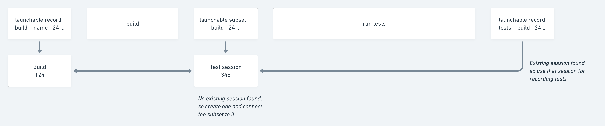
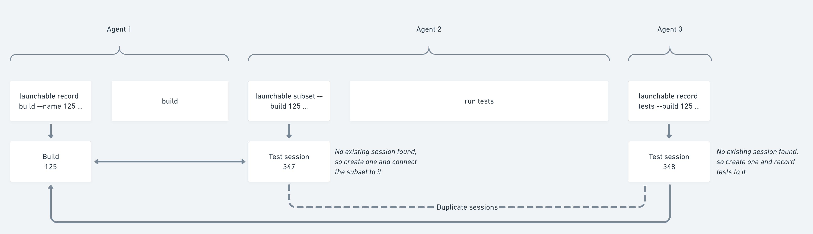

# Managing complex test session layouts

## Background

The **test session** is one of Launchable's core concepts. When you request a subset of tests from Launchable, the subset is linked to a test session. Similarly, you record test results, those results are recorded to the same test session. This concept is useful because tests might run several times against the same build; it helps disambiguate those runs.

By default, the Launchable CLI handles creating, saving, and retrieving a session in the background. When you run `launchable subset` or `launchable record tests`, the CLI checks for an existing session file in `~/.config/launchable`. If it finds one, it uses it. If not, the CLI gets a new session ID from Launchable and saves it to a file in `~/.config/launchable`.

_Recording tests:_


_Subsetting and recording tests:_



This ensures that `launchable subset` and `launchable record tests` commands are 'linked', which is important for proper instrumentation.

However, there are a few cases where you might need to override this implicit behavior and create a session explicitly_:_

## Test report collection happens on a different machine

Sometimes, the build, test, and reporting steps are split between different machines. This can cause two issues:

### Extra sessions

This can cause an extra session to be created, because `launchable record tests` doesn't find the session created by `launchable subset`:



### Reused sessions

Or, if the reporting machine is reused and persistent, the saved session from `launchable record tests`may be accidentally reused, combining tests from different sessions against the same build:


### Solution

The best way to resolve these issues is to use `launchable record session` to explicitly create and store a session before you run your tests. You'll use that value with `launchable subset` and then pass this it through to the reporting phase.

You'll use `--session` instead of `--build` in `launchable subset` and `launchable record tests`. Here's some pseudocode to illustrate:

```bash
# machine 1

    # build step
    launchable record build --name <BUILD NAME> [OPTIONS]

    # build software
    bundle install

# machine 2

    # before running tests, save a session token
    # you'll use this token again later
    launchable record session --build <BUILD NAME> > launchable-session.txt

    # get a subset, if applicable
    launchable subset --session $(cat launchable-session.txt) [OPTIONS]

    # run tests
    bundle exec rails test [OPTIONS]

# machine 3

    # record test results
    launchable record tests --session $(cat launchable-session.txt) [OPTIONS]
```

## Combining test reports from multiple runs

Some pipelines execute multiple test runs against a build in a single test session, outputting distinct test report\(s\) across several machines.

For example, one test session might include a Cypress run, a GoogleTest run, and a Bazel run, all executed separately, generating their own test report XML file\(s\) on separate machines.

These are all ostensibly part of a single test session, so it's desirable to treat them as such.


This _may_ also be the case if you execute tests of a _single_ type across several parallel runs, but usually the test runner can combine reports from parallel runs for consumption from a single place.

If all the test reports for a session can be collected from a single machine, you don't need to use this method.


So, if you need to capture test reports from several machines, you can tell Launchable that they all relate to the same **test session** using the `launchable record session` command and the corresponding `--session` parameter _\(note: pseudocode\)_:

```bash
## build step

# before building software, send commit and build info
# to Launchable
launchable record build --build <BUILD NAME> [OPTIONS]

# build software the way you normally do, for example
bundle install

## test step

# before running tests, save a session token
# you'll use this token to group the test reports together later
launchable record session --build <BUILD NAME> > launchable-session.txt

    # start multiple test runs

        # machine 1

            # run tests
            bundle exec rails test

            # send test results to Launchable from machine 1
            # Note: You need to configure the line to always run whether test run succeeds/fails.
            #       See each integration page.
            launchable record tests --session $(cat launchable-session.txt) [OPTIONS]

        # machine 2

            # run tests
            bundle exec rails test

            # send test results to Launchable from machine 2
            # Note: You need to configure the line to always run whether test run succeeds/fails.
            #       See each integration page.
            launchable record tests --session $(cat launchable-session.txt) [OPTIONS]

        ## repeat as needed...

## finish multiple test runs
```

You can read more about `launchable record session` in the [CLI reference](../resources/cli-reference.md#record-session).

