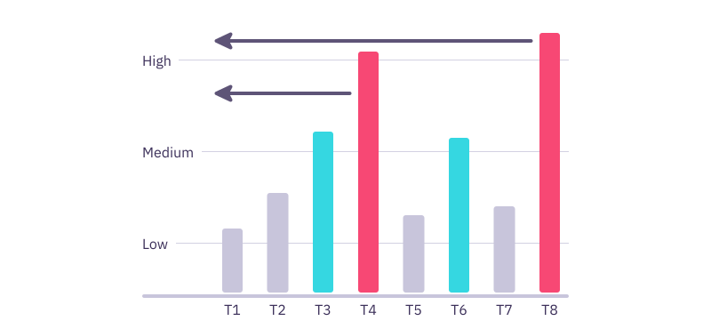

# How it works

## The basics

The core of the Launchable platform is a machine-learning algorithm that reorders tests suites based on incoming changes so that tests that are likely to fail are run first.

The algorithm analyzes incoming changes and assigns a probability of failure to each test in a suite. It then returns an ordered list of recommendations to your test runner on which tests to run. Tests are ordered based on probability of failure and test run time \(more on this later\).

## How the model is trained

After tests are run the results are passed to Launchable and used to continuously train the model.

If you are involved in our early beta program you may have been given an `ingester` program which is used to import your run history from Jenkins or CircleCI and accelerate the training process.

Model training looks at the changes associated with each build and which tests fail. It builds associations between line changes in files and which tests tend to fail. It can be thought of as an advanced frequency counting algorithm that tracks associations between failures and source code.

Model training generally takes **between 3 and 10 weeks** and depends on the number of runs and frequency of failure. More data makes the model more accurate, but reasonable accuracy is generally  obtained within a few weeks.

## Calculating test order

One way to think about how Launchable reorders your tests is that with each successful test, Launchable's confidence grows that the entire run will be successful. The ideal algorithm optimizes for the **highest confidence as early as possible.**

So _confidence_ and _individual test run time_ are the two primary factors in test reordering.

Confidence is a function of the probability of failure for each individual test as tests run. Tests with a high probability of failure, when successful, yield higher confidence gain. When low probability of failure tests pass, they yield smaller confidence gains.

Since our goal is to grow confidence as fast as possible, it makes sense for Launchable to _deprioritize_ long running tests if the confidence gain is not high enough to offset the gain of running shorter tests during the same period of time. This is exactly what the Launchable algorithm does.

For example, if test T8 has a high probability of failure and takes 3 min, while test T4 has a slightly lower probability of failure, but takes 300 milliseconds, Launchable will prioritize the shorter test \(T4\) before the longer test \(T8\) because the confidence gain is higher during a shorter period of time.


We are currently exploring other factors that may influence test order, such as cases where tests have order dependency on other tests. [Contact us](https://launchableinc.com/contact) if you're interested in learning more.


## Subsetting tests

If your tests take a very long time to run, you may want to consider running a subset of your tests earlier in your development cycle \(shift-left\). For example, if a post merge suite takes 5 hours to run, a 30 minute version of the same suite could be run pre-merge on the pull request.

While you could manually subset your tests to accomplish this, it has the disadvantage that the most relevant tests to the changes present in a build may not be run until much later in the development cycle. Launchable provides the ability to create a **dynamic subset** based on the changes present in the build. We call this an _adaptive subset_.

An **adaptive subset** uses the same list generated when you ask Launchable to reorder your tests, but only returns the first part of the total list to your test runner. The cutoff point can be based on either the length of time you specify \(in the example above 30 min\) or the confidence level you wish to achieve.

## How it integrates with your test suite

Launchable integrates with your test suite through your test runner. We provide a plugin for your test runner which interacts with the Launchable API.

Basically, when a build is ready for testing:

1. Your test runner sends changes over to Launchable
2. Launchable responds with which tests to run in which order
3. Your test runner runs the tests on your CI server
4. Your test runner sends the results to Launchable to continuously train the machine learning model


We're actively building test runner plugins for members of our early beta program. See [integrations](integrations/) to learn more about the plugins that are currently available. [Contact us](https://www.launchableinc.com/contact) to request an additional integration.


## What data is sent to our servers?

Launchable’s machine-learning algorithm learns the relationship between code changes and the tests impacted by those changes through metadata that is sent to the Launchable API through your test runner. 

We do not currently use static code analysis, so the full contents of your source code does not need to be sent to our servers. The data that is sent currently includes...

Metadata about the **code changes being tested**:

* the names and paths of files added/removed/modified in the change
* number of modified lines in files in the change
* the location of modified lines in the files in the change
* Git commit hashes associated with the change
* Git author details associated with those commits

Metadata about the **test cases that were run**:

* the names and paths of test cases and test files
* pass/fail/skipped status of each test case
* the duration \(run time\) of each test case
* test case associations to test suites \(e.g. ‘unit tests,' ‘integration tests,’ etc.\)
* File names
* Lines changed
* etc

